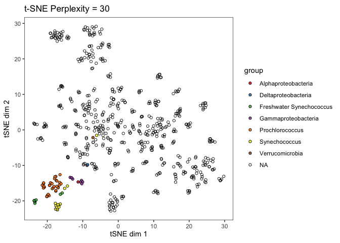
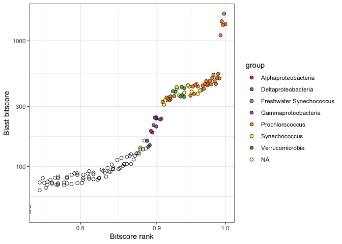
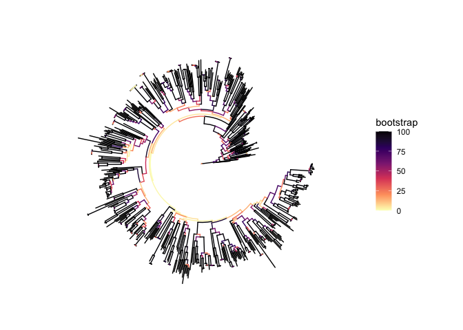
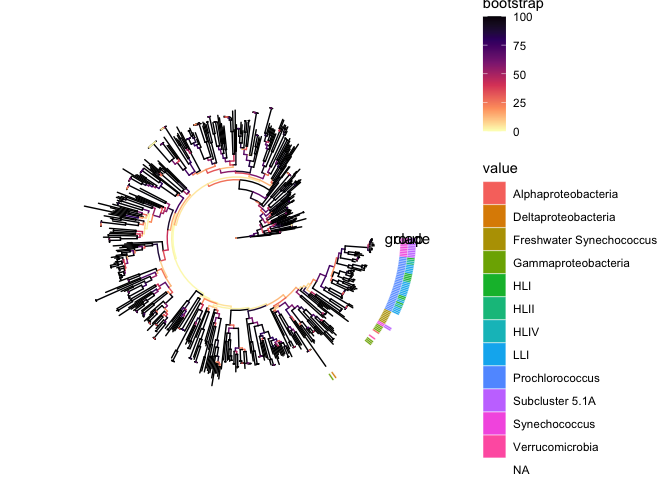

Sequence Similarity
================

  - [Load data](#load-data)
  - [Funtions](#funtions)
  - [Format data](#format-data)
  - [Run tSNE](#run-tsne)
  - [Rank abundance curve](#rank-abundance-curve)
  - [Phylogenetic tree](#phylogenetic-tree)

``` r
library(here)
library(tidyverse)
library(Rtsne)
```

## Load data

Load blastp evalues between all tbdts

``` r
tbdts_score1 <- read_tsv(here::here("tbdt_sequence_similarity", 
                                    "data", 
                                    "pro_syn_tbdt_recip_besthits_filt.tab"),
                         col_names=c("source", "target", "pident", "length", "mismatch", "
                                     gapopen", "qstart", "qend", "sstart", "send", "evalue", "bitscore"),
                         col_types="ccdddddddddd")
```

Load Pro tbdt metadata

``` r
tbdt_meta <- read_tsv(here::here("tbdt_sequence_similarity", 
                                 "data",
                                 "tbdt_associated_data.txt"))
```

    ## Parsed with column specification:
    ## cols(
    ##   new_gene = col_character(),
    ##   new_genome = col_character(),
    ##   old_gene = col_character(),
    ##   old_genome = col_character(),
    ##   group = col_character(),
    ##   clade = col_character(),
    ##   station = col_character(),
    ##   depth = col_double()
    ## )

## Funtions

tSNE function wrapper

``` r
tsne2gg <- function(perpl, dims, theta, matdf, anndf){
    tsne_model <- Rtsne(as.matrix(matdf), 
                    is_distance = FALSE,
                    initial_dims = dims,
                    perplexity = perpl,
                    theta=theta,
                    verbose=FALSE,
                    max_iter = 1000,
                    check_duplicates=FALSE)
    d_tsne = as.data.frame(tsne_model$Y)
    d_tsne$gene <- rownames(matdf)
    colnames(d_tsne) <- c("x", "y", "new_gene")
    d_tsne_rt <- d_tsne %>% full_join(anndf)
    return(d_tsne_rt)
}
```

``` r
ggtsne <- function(perpl, df){
    ggplot(df, aes(x=x, y=y)) + 
    geom_jitter(aes(fill=group), size=1.5, width=0.5, height=0.5, shape=21, alpha=0.85) +
    labs(x="tSNE dim 1", y="tSNE dim 2") +
    ggtitle(paste("t-SNE Perplexity = ", perpl, sep="")) +
    scale_fill_brewer(palette="Set1") +
    coord_fixed() + 
    theme_bw() +
    #theme_light(base_size=10) +
    theme(panel.grid.major = element_blank(), panel.grid.minor = element_blank(), panel.background = element_blank())
    }
```

## Format data

``` r
tbdts_score2 <- 
  tbdts_score1 %>%
  select(source, target, bitscore)
```

``` r
t <- with(tbdts_score2,tapply(bitscore,list(source,target),"[[",1)) 
t[is.na(t)] <- 0
dim(t)
```

    ## [1] 625 625

## Run tSNE

``` r
set.seed(457832)
tsne_30 <- tsne2gg(30, 625, 0.5, t, tbdt_meta)
```

    ## Joining, by = "new_gene"

``` r
p <- ggtsne(30, tsne_30)
p
```

    ## Warning: Removed 1 rows containing missing values (geom_point).

<!-- -->

``` r
ggsave(here::here("tbdt_sequence_similarity", "figs", "tsne_p30.svg"), 
       plot = p, units = "in", width = 7, height=5, device = "svg", dpi=300)
```

    ## Warning: Removed 1 rows containing missing values (geom_point).

``` r
ggsave(here::here("tbdt_sequence_similarity", "figs", "tsne_p30.png"), 
       plot = p, units = "in", width = 7, height=5, device = "png", dpi=300)
```

    ## Warning: Removed 1 rows containing missing values (geom_point).

## Rank abundance curve

``` r
MIT0917_hits_ranked <- tbdts_score1 %>% 
    filter(source == '001370_1570014') %>%
    mutate(rank = percent_rank(bitscore)) %>% 
    left_join(., rename(tbdt_meta, target=new_gene)) %>%
    distinct(target, .keep_all = T)
```

    ## Joining, by = "target"

``` r
target_rank_fct <- MIT0917_hits_ranked %>% arrange(desc(rank)) %>% pull(target)

MIT0917_hits_ranked <- MIT0917_hits_ranked %>%
  mutate(target=factor(target, levels=target_rank_fct))
```

``` r
p <- ggplot(MIT0917_hits_ranked, aes(x=rank, y=bitscore)) + 
  geom_jitter(aes(fill=group), size=2, width=0, height=0.05, shape=21, alpha=0.85) +
  scale_fill_brewer(palette="Set1") +
  theme(axis.title.x=element_blank(),
        axis.text.x=element_blank(),
        axis.ticks.x=element_blank()) +
  labs(y="Blast bitscore", x="Bitscore rank") +
  scale_y_continuous(trans="log10") +
  scale_x_continuous(trans="log10", limits = c(0.75, 1)) +
  theme_bw()

p
```

    ## Warning: Transformation introduced infinite values in continuous x-axis

    ## Warning: Removed 378 rows containing missing values (geom_point).

<!-- -->

``` r
ggsave(here::here("tbdt_sequence_similarity", "figs", "rank_plot.svg"), 
       plot = p, units = "in", width = 7, height=5, device = "svg", dpi=300)
```

    ## Warning: Transformation introduced infinite values in continuous x-axis
    
    ## Warning: Removed 378 rows containing missing values (geom_point).

``` r
ggsave(here::here("tbdt_sequence_similarity", "figs", "rank_plot.png"), 
       plot = p, units = "in", width = 7, height=5, device = "png", dpi=300)
```

    ## Warning: Transformation introduced infinite values in continuous x-axis
    
    ## Warning: Removed 378 rows containing missing values (geom_point).

## Phylogenetic tree

``` r
library(ggtree)
```

    ## Registered S3 method overwritten by 'treeio':
    ##   method     from
    ##   root.phylo ape

    ## ggtree v2.0.1  For help: https://yulab-smu.github.io/treedata-book/
    ## 
    ## If you use ggtree in published research, please cite the most appropriate paper(s):
    ## 
    ## - Guangchuang Yu, Tommy Tsan-Yuk Lam, Huachen Zhu, Yi Guan. Two methods for mapping and visualizing associated data on phylogeny using ggtree. Molecular Biology and Evolution 2018, 35(12):3041-3043. doi: 10.1093/molbev/msy194
    ## - Guangchuang Yu, David Smith, Huachen Zhu, Yi Guan, Tommy Tsan-Yuk Lam. ggtree: an R package for visualization and annotation of phylogenetic trees with their covariates and other associated data. Methods in Ecology and Evolution 2017, 8(1):28-36, doi:10.1111/2041-210X.12628

    ## 
    ## Attaching package: 'ggtree'

    ## The following object is masked from 'package:tidyr':
    ## 
    ##     expand

``` r
#library(tidytree)
library(treeio)
```

    ## treeio v1.10.0  For help: https://yulab-smu.github.io/treedata-book/
    ## 
    ## If you use treeio in published research, please cite:
    ## 
    ## LG Wang, TTY Lam, S Xu, Z Dai, L Zhou, T Feng, P Guo, CW Dunn, BR Jones, T Bradley, H Zhu, Y Guan, Y Jiang, G Yu. treeio: an R package for phylogenetic tree input and output with richly annotated and associated data. Molecular Biology and Evolution 2019, accepted. doi: 10.1093/molbev/msz240

``` r
library(ape)
```

    ## 
    ## Attaching package: 'ape'

    ## The following object is masked from 'package:treeio':
    ## 
    ##     drop.tip

    ## The following object is masked from 'package:ggtree':
    ## 
    ##     rotate

``` r
library(phangorn)
```

load raxml file

``` r
tbdt_phylo <- read.raxml(here::here("tbdt_sequence_similarity", 
                                   "data",
                                   "RAxML_bipartitionsBranchLabels.marine_tbdt"))
```

``` r
p1 <- ggtree(tbdt_phylo, aes(color=bootstrap), layout="circular") +
  #geom_nodepoint() + #, layout=""
  #scale_size(range = c(0.1, 1), limits = c(50,100)) +
  scale_color_viridis_c(option = "A", direction = -1, na.value = "#000000")
p1
```

<!-- -->

``` r
tbtds2tree <- tbdt_meta %>% 
  column_to_rownames(var="new_gene") %>%
  select(group, clade)
```

``` r
p2 <- gheatmap(p1, tbtds2tree, offset = 0.1, width=0.1)
p2
```

<!-- -->

``` r
ggsave(here::here("tbdt_sequence_similarity", "figs", "tree.svg"), 
       plot = p2, units = "in", width = 7, height=5, device = "svg", dpi=300)

ggsave(here::here("tbdt_sequence_similarity", "figs", "tree.png"), 
       plot = p2, units = "in", width = 7, height=5, device = "png", dpi=300)
```
